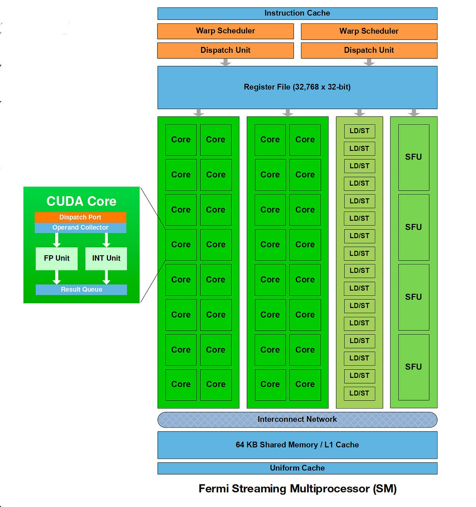

# Senior Project CPE 461/462 - Robert Burns

**Abstract:** I plan to implement a Streaming Multiprocessor based on Nvidia's 2010 Fermi Architecture **[1]** **[2]**. I am doing this as I want to pursue GPU and other parallel architectures as the focus of my Masters studies, and having a foundational project will help me have a solid understanding while finishing my undergraduate degree. I chose the Fermi Streaming Multiprocessor to build as it felt like a challenging, yet scalable project where I could view public diagrams and information. This project's reverse engineering of the Core and SM architecture, while hard, will remain easier due to the public information describing its inner working [2] and since its an old architecture 

This project consists of multiple components, including a CUDA core, load/store unit (LD/ST), special function unit (SFU), warp scheduler, and register file (RF), with the overall streaming multiprocessor organization derived from the publicly available NVIDIA Fermi SM block diagram **[2]**. 

 
  

Figure 1: NVIDIA Fermi Streaming Multiprocessor block diagram (adapted from [2]).

I plan to implement the project with set checkpoints as follows:
- Cuda Core (Int Only)

## Weekly Contributions

**Week 1:** Created project abstract and shared with Dr. Maria Pantoja

**Week 2:** 

## References

[1] “Fermi (microarchitecture),” *Wikipedia, The Free Encyclopedia*, Wikipedia, Jan. 2026. [Online]. Available: https://en.wikipedia.org/wiki/Fermi_(microarchitecture).

[2] P. N. Glaskowsky, “NVIDIA’s Fermi: The First Complete GPU Computing Architecture,”White Paper, NVIDIA Corp., Sept. 2009. [Online]. Available: https://www.nvidia.com/content/pdf/fermi_white_papers/p.glaskowsky_nvidia's_fermi-the_first_complete_gpu_architecture.pdf.
